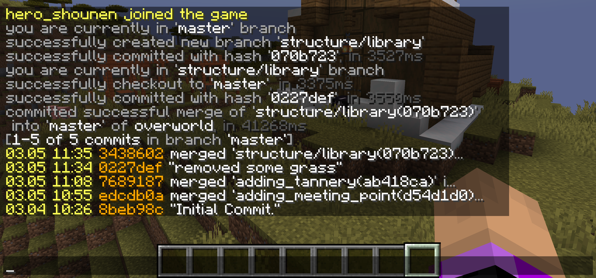

# Pixel - version control with Minecraft
마인크래프트 월드의 __region__, __entities__, __poi__ 데이터를 버전관리하기 위한, 서버측 spigot 플러그인.  
Git 과 비슷한 명령으로 마인크래프트 지형 및 건축물, 엔티티를 버전관리해보세요!  
  
커밋, 브랜치 분기 및 병합, 브랜치 간 이동(체크아웃), 커밋 취소 등의 기능이 있습니다.
  


## 이 파일의 내용
[서버에 추가](#서버에-추가)  
[사용 가능한 커맨드](#사용-가능한-커맨드)  
[작동](#작동)  
&nbsp;&nbsp;&nbsp;&nbsp;[일관성](#일관성)  
&nbsp;&nbsp;&nbsp;&nbsp;[병합](#병합)  
&nbsp;&nbsp;&nbsp;&nbsp;&nbsp;&nbsp;&nbsp;&nbsp;[병합의 중단](#병합의-중단)  
&nbsp;&nbsp;&nbsp;&nbsp;&nbsp;&nbsp;&nbsp;&nbsp;[병합의 원복](#병합의-원복)  
&nbsp;&nbsp;&nbsp;&nbsp;[기존 Overworld 월드와 버전관리 Overworld 월드](#기존-Overworld-월드와-버전관리-Overworld-월드)  
[주의사항](#주의사항)  
&nbsp;&nbsp;&nbsp;&nbsp;[저장소 초기화](#저장소-초기화)  
&nbsp;&nbsp;&nbsp;&nbsp;[detached HEAD](#detached-head)  
&nbsp;&nbsp;&nbsp;&nbsp;[커밋 확인 인수](#커밋-확인-인수)  
&nbsp;&nbsp;&nbsp;&nbsp;[Reset과 Recover, Discard](#reset-recover-discard)  
[TL;DR](#tldr)

## 서버에 추가
플러그인 jar 파일을 서버의 `/plugins` 디렉터리에 배치합니다.  
Nether와 TheEnd 월드는 그 자체로 버전관리가 가능하나, Overworld 월드 는 그 자체로 버전관리가 불가능하여 
플러그인을 서버에 추가하고 첫 실행 시 이미 있던 기존 Overworld 를 복제하여 버전관리를 진행할 새로운 월드 <i><b>level_name</b></i>_overworld 를 새로 생성합니다.   
  
월드의 생성이 모두 끝나고 서버가 정상적으로 수행되면, 버전관리 기능을 이용하기 위해 다음 작업을 수행합니다.  
  
`/pixel init`  
`/pixel commit all "Initial Commit"`  
  
모두 끝났습니다!  
이제 여러분은 아래의 커맨드들을 이용하여 월드의 일부 데이터를 버전관리할 수 있게 되었습니다.

## 사용 가능한 커맨드
- ```/pixel init [force]```  
Git 로컬 저장소를 초기화합니다.  
`force` 옵션이 지정되고 이미 저장소가 있을 경우 <b>기존 것은 삭제되고 다시 초기화</b><sup>[[1]](#저장소-초기화)</sup>됩니다.
  

- ```/pixel commit <dimension> <commit_message>```  
Git 커밋을 진행합니다.
  - dimension : 변경사항을 커밋에 포함할 월드
  - commit_message : 커밋 메시지. 띄어쓰기를 해도 된다.
  

- ```/pixel reset <dimension> <steps|commit_hash>```  
Git 리셋을 진행합니다. 헤드의 위치를 n커밋 뒤로 옮기거나 특정 커밋으로 옮깁니다.
  - dimension : 리셋을 반영할 월드
  - steps : 뒤로 몇 커밋을 이동할지에 대한 값
  - commit_hash : 이동할 커밋의 커밋해시. 이동한 커밋의 이후 커밋은 모두 삭제됩니다.
  

- ```/pixel discard <dimension>```  
커밋하지 않은 모든 변경사항을 취소하고 마지막 커밋의 상태로 되돌립니다.
  - dimension : 변경사항을 취소할 월드
  

- ```/pixel branch <new_branch_name|-d> [branch_to_delete]```  
현재의 커밋을 기점으로하는 새로운 브랜치를 만들거나, 현재 브랜치가 아닌 특정 브랜치를 삭제합니다.  
새로운 브랜치를 만들었을 경우, 자동으로 해당 브랜치로 체크아웃합니다.
  - new_branch_name : 생성할 브랜치 이름
  - -d : 브랜치를 삭제하려는 경우 해당 값을 인수에 전달
  - branch_to_delete : 첫 인수가 `-d` 일 경우 반드시 전달해야함. 삭제할 브랜치의 이름.
  

- ```/pixel checkout <dimension> <branch|commit_hash> <commit_confirm>```  
특정 커밋<sup>[[2]](#detached-head)</sup>, 혹은 브랜치로 체크아웃합니다.
  - dimension : 체크아웃 이후의 상황을 반영할 월드
  - branch : 체크아웃할 타겟 브랜치
  - commit_hash : 체크아웃할 타겟 커밋
  - commit_confirm : 체크아웃 하기 전에 현재까지의 변경사항을 커밋했는지에 대한 확인<sup>[[3]](#커밋-확인-인수)</sup>
  

- ```/pixel checkout <dimension> -recover```  
버전관리 데이터가 꼬였을 것으로 예상되는 경우, 마지막 커밋 상태로 버전관리 데이터를 clean 할 수 있습니다.<sup>[[6]](#reset-recover-discard)</sup><sup>[[7]](#일관성)</sup>
  

- ```/pixel merge <dimension> <branch|commit_hash> <merge_mode> <commit_confirm>```  
특정 커밋 혹은 브랜치를 HEAD<sup>[[2]](#detached-head)</sup>와 병합<sup>[[5]](#병합)</sup>합니다.
  - dimension : 병합을 진행할 월드
  - branch : 병합을 진행할 source 브랜치. (A를 B에 병합한다고 할 때 A를 말함)
  - commit_hash : 병합을 진행할 source 커밋. (A를 B에 병합한다고 할 때 A를 말함)
  - merge_mode : keep 혹은 replace 중 하나. keep 일 경우 병합 충돌 발생 시 HEAD 의 값을, replace 일 경우 source 의 값을 반영합니다.
  - commit_confirm : 병합을 진행하기 전에 현재까지의 변경사항을 커밋했는지에 대한 확인<sup>[[3]](#커밋-확인-인수)</sup>
  

- ```/pixel merge abort```  
병합을 중단합니다. <b>병합이 현재 진행중일 때만 수행 가능합니다.</b>
  

- ```/pixel list <what>```  
커밋, 혹은 브랜치의 목록을 출력합니다.
  - what : commits 혹은 branches 중 하나. 각각 커밋의 목록과 브랜치의 목록을 출력합니다.
  

- ```/pixel tp <target> <dimension>```  
플레이어를 지정한 월드의 동일한 좌표 위치로 텔레포트합니다.<sup>[[4]](#기존-Overworld-월드와-버전관리-Overworld-월드)</sup>
  - target : 텔레포트할 플레이어의 닉네임
  - dimension : 도착 월드. dummy 혹은 overworld 중 하나.
  

- ```/pixel whereis <target>```  
플레이어가 현재 어느 월드에 있는지를 출력합니다.
  - target : 확인할 플레이어의 닉네임


## 작동
깃을 통해 월드의 __region__, __entities__, __poi__ 데이터를 버전관리합니다.   
정확히는 각 월드의 __위의 세 디렉터리 내의 mca 파일만__ 버전관리가 수행됩니다.  
그러나 해당 플러그인은 __여러 사람이 따로 작업하는 상황을 유도하는 플러그인이 아니며__, 단 하나의 로컬 저장소(서버)만 존재하는 형태입니다.

플러그인은 버전관리가 수행되는 로컬 저장소를 따로 생성하고, 그곳에 region 데이터를 저장, 버전관리합니다.  
거의 모든 버전관리와 관련된 명령은 __dimension__ 인수를 받는데, 이것은 실제 월드 데이터를 버전관리 데이터 폴더로 복사하여
로컬 저장소의 변경사항을 만들 월드를 지정하거나, 로컬 저장소의 버전관리 데이터를 실제 월드에 반영할 월드를 지정하는 인수입니다.  
따라서 이 __dimension__ 인수에 포함되지 않는 월드는 실제 월드에도, 로컬저장소에도 <b>이 플러그인의 커맨드 작업</b>에 따른 변경사항이 버전관리 데이터에 반영되지 않습니다.

예를 들어, 마인크래프트를 통해 오버월드, 네더에 변경사항을 만들고 overworld 라는 dimension 인수를 통해 commit 을 수행할 경우 해당 커밋에는 nether 의 변경사항은 포함되지 않습니다.

### 일관성
버전관리 폴더는 항상 <b>변경사항이 생긴 동시에 커밋</b>하도록 되어있습니다.
다시말해, 실제 월드에 변경사항을 만든다고 버전관리 폴더에서 변경사항이 생기는 것이 아니며 실제 월드에 변경사항을 만들고 커밋 커맨드를 입력하면 그 때 버전관리 폴더에 변경사항을 반영하고 바로 커밋합니다.  
따라서 체크아웃, 병합 등의 버전관리 데이터를 실제 월드에 반영하는 커맨드를 수행 중 예외가 발생할 경우 버전관리 폴더에는 반영된 데이터가 실제 월드에는 반영되지 않았을 가능성이 있습니다.  
이런 경우가 의심될 경우, `/pixel checkout <dimension> -recover` 커맨드를 사용하면 버전관리 데이터를 마지막 커밋의 상태로 복구할 수 있습니다.  
  
반대로, 실제 월드의 데이터를 버전관리 데이터에 맞추고 싶다면 `/pixel discard <dimension>`<sup>[[6]](#reset-recover-discard)</sup> 을 수행합니다.  

나머지 사항은 Git 의 그것과 최대한 비슷하도록 구성했습니다.

몇몇 커맨드를 수행하면 엔터를 치자 마자 갑자기 월드가 사라지는 것처럼 보이는데, 월드를 언로드하여 데이터를 읽기 위해 잠시 해당 월드에 있는 플레이어를 공허 세계<sup>[[4]](#기존-Overworld-월드와-버전관리-Overworld-월드)</sup>로 이동시킨 것입니다.  
월드를 정상적으로 읽고, 다시 로드가 성공할 경우 자동으로 다시 돌아오며, 만약 그렇지 않더라도 서버를 재시작한 후 `/pixel tp` 명령을 통해 원래 세계로 돌아갈 수 있습니다.


### 병합
__병합은 병합 커맨드를 수행하지 않으면 진행되지 않으므로, 병합을 사용하지 않으신다면 이 영역은 건너뛰셔도 좋습니다.__  
  
병합은 Git을 통해 수행하지 않습니다. 압축된 파일 그대로 버전관리가 수행되기 때문에 Git을 통한 병합이 불가능하며, 만약 읽을 수 있는 데이터로 변환되어있다고 하더라도
Palette 데이터 구조 및 Packed Array 구조에 의해 데이터의 일관성이 무너지기 때문에 병합의 수행은 내부 알고리즘으로 따로 수행됩니다.

각 데이터에 대해 병합은 다음처럼 진행됩니다.
- __region__  
  파일 각각의 청크 NBT 데이터 중에서도 `block_data` 와 `block_entities` 데이터에 대해서만 진행되는데, 그 방식은 Git의 그것과 비슷합니다.  
  청크 내의 모든 블럭에 대해, 병합하려는 두 커밋의 공통 부모로부터 각 커밋의 변경사항을 찾고, 한쪽만 변경되었다면 변경된 것을, 둘 다 변경되었다면 병합 모드에 따라 둘 중 하나를 선택하여 반영합니다.
- __entity__  
  병합하려는 두 커밋에 포함되는 모든 엔티티에 대해, 공통 부모로부터 변경사항을 찾아 UUID 를 기준으로 한 쪽에만 있는 엔티티는 그것을 바로 반영하고, 둘 다에 있는 엔티티는 병합모드에 따라 하나를 선택합니다.  
  <b>다시말해, 같은 엔티티(UUID를 기준으로 함)가 두 커밋에 모두 있을 경우 그 둘의 데이터가 병합되는 것이 아닌 하나만 선택되고 하나는 삭제됩니다.</b>
- __poi__  
  병합하려는 두 커밋에 포함되는 모든 poi record를 pos를 기준으로 집합화 하고, 각 poi record에 대해 free_tickets 값을 업데이트합니다.  
  poi record 의 type과 pos를 사용해 현재 이 poi record를 <b>가진</b> 모든 주민을 찾고, 만약 그 수가 2를 넘을 경우 병합 모드에 따라 한쪽 주민의 값을 지웁니다.  
  예를 들어, type 이 minecraft:cartographer 였고 이 pos에 해당하는 job_site 를 가진 주민이 두 커밋에 모두 있었을 경우 병합모드에 따라 한쪽 주민의 job_site 를 삭제합니다.  
  쉽게 말하면 <b>A 커밋에서는 지도작업대 X를 a 주민이 잡고있었고, B 커밋에서는 지도작업대 X를 b 주민이 잡고있었으며 B를 A로 keep 모드를 사용해 병합한다면 병합 이후에 지도작업대 X는 a가 잡고있으며 b는 직업을 잃게 됩니다.</b>  
  만약 그 수의 값이 1 이하였을 경우 해당 값을 그대로 반영합니다.  
  - __예외__  
    poi record 중 meeting 타입을 가진 레코드의 경우, 무조건 값을 32로 되돌리고 해당 poi record를 <b>가진</b> 모든 주민의 meeting_point 값을 삭제합니다.


다만, 병합 알고리즘이 완벽하지 않고 전체 데이터를 병합하는 것이 아닌 일부 데이터만 병합하고 있기 때문에 나머지 데이터와의 마인크래프트 시스템 내 일관성 문제 및 여러 다른 문제가 발생할 수 있으므로 사용에 주의가 필요합니다.

#### 병합의 중단
병합이 진행 중일 때 특정 진행 상황에서는 병합을 중단시킬 수 있습니다.  
병합 커맨드를 입력한 후 공허세계로 이동되기 전까지 병합을 위한 계산을 진행하는 동안에는, `/pixel merge abort` 커맨드를 통해 병합을 중단할 수 있습니다.  

#### 병합의 원복
어디까지나 병합도 그 자체의 알고리즘만 다를 뿐, 버전관리가 진행되는 사항입니다.  
따라서 `/pixel list commits` 를 통해 병합 커밋을 확인할 수 있고, 병합 결과가 이상하면 얼마든지 `/pixel reset` 커맨드로 원복할 수 있습니다.

### 기존 Overworld 월드와 버전관리 Overworld 월드
플러그인이 처음 활성화될 때, 두 개의 월드 <b>void</b>(공허세계, 버전관리 월드를 언로드하기 위해 커맨드 수행 과정 동안 플레이어가 잠시 머무르게 되는 월드), <b><i>level_name</i>_overworld</b>(생성 시점의 기존 Overworld 월드의 복제)를 새로 생성합니다.
그러면 일반적인 경우 서버에는 총 다섯 개의 월드가 존재하게 됩니다.  
그 중 <b><i>level_name</i>_overworld</b>, <b><i>level_name</i>_nether</b>, <b><i>level_name</i>_the_end</b>는 버전관리가 진행되는 월드, <b><i>level_name</i></b>은 그렇지 않은 월드가 됩니다.

그러나 기존 Overworld 월드와 버전관리가 진행되는 Overworld 월드의 베이스는 같기 때문에, 간혹 어느 월드에 있는지 헷갈릴 때가 있을 수 있습니다.  
그럴 때 `/pixel whereis` 커맨드를 통해 현재 월드를 파악하거나, `/pixel tp` 커맨드를 사용하여 가려는 월드로 텔레포트할 수 있습니다.


## 주의사항

### 저장소 초기화
마인크래프트 월드은 그 자체만으로 이미 용량이 크고, 이미 압축된 데이터이기 때문에 한 번 커밋할 때마다 많은 용량을 잡아먹습니다.
따라서 용량이 충분하지 않은 환경이라면, '더이상 이전 기록들은 필요없겠다' 싶은 시점을 잘 찾아서 이전 기록을 날리고 다시 초기화해줄 필요가 있습니다.  
이것이, `/pixel init` 커맨드가 이미 저장소가 존재하더라도 그것을 지우고 다시 초기화하는 이유입니다.

### detached HEAD
`/pixel checkout` 커맨드를 통해 특정 커밋으로 체크아웃할 경우, HEAD가 브랜치를 가리키는 것이 아닌 커밋을 직접 가리키게 됩니다.
이 상황에서 추가로 커밋하거나 병합을 시도할 경우 어느 브랜치에 커밋이 포함될지 불명확하기 때문에 예외를 발생시킵니다. 
따라서, 커밋으로 체크아웃 한 후에 변경사항을 만드려면 반드시 커밋 전에 `/pixel branch` 커맨드를 통해 새로운 브랜치를 만들어주세요.

### 커밋 확인 인수
체크아웃 혹은 병합을 수행할 시 버전관리 상의 데이터를 현재 월드에 덮어쓰기 때문에, 커밋하지 않은 변경사항은 소실됩니다.
의도적으로 변경사항을 버리고싶은 경우가 아니라면 반드시 두 명령을 수행하기 전에 모든 변경사항을 커밋하시고, 해당 인수에 `true`를 전달해주세요.   
이 인수는 커맨드 실행 전 '아 맞다 커밋 안했다' 를 생각나게 해줄 하나의 장치입니다.

### Reset과 Recover, Discard
reset과 recover, discard 는 서로 차이가 있습니다.  
각각 정확히 수행되는 일은 다음과 같습니다.
- reset: 커밋을 되돌리고 그 이전 상태의 버전관리 데이터를 실제 월드에 반영
- discard: 현재 버전관리 데이터를 실제 월드에 반영
- recover: 버전관리 데이터의 변경 사항을 지우고 마지막 커밋 상태로 되돌리며, 그 사항을 월드에도 반영

특히, 병합 과정 중 월드에 반영이 시작된 이후 오류가 발생하면 버전관리 데이터와 월드 사이의 일관성이 깨지며(버전관리 데이터가 변경되었고 월드에는 반영되지 않았으나 커밋도 되지 않았음), 해당 상태로 discard 를 수행할 경우 실제 월드이 잘못된 데이터로 덮어씌워질 우려가 있습니다.  
이 때 recover 를 수행하면, 잘못된 버전관리 데이터가 제거되고 병합을 수행하기 이전으로 되돌릴 수 있습니다.

## TL;DR
- 마인크래프트 월드의 <b>regions</b>, <b>entities</b>, <b>poi</b>만 버전관리합니다.
- 이미 존재하던 서버에 해당 플러그인을 추가할 경우 플레이어를 모두 `/pixel tp <target> overworld` 를 통해 버전관리 월드로 텔레포트시킬 필요가 있습니다.
- 커맨드에 전달되는 dimension 인수에 대해서만 변경사항이 로컬 저장소 혹은 클라이언트 디렉터리에 반영됩니다.
- 병합은 regions 데이터 중에서도 '각 좌표에 할당된 블럭에 대한 정보'에 대해서만 수행됩니다.
